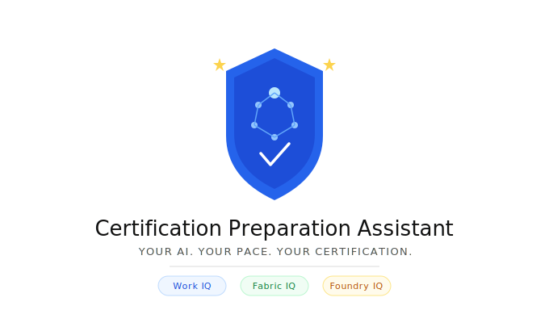
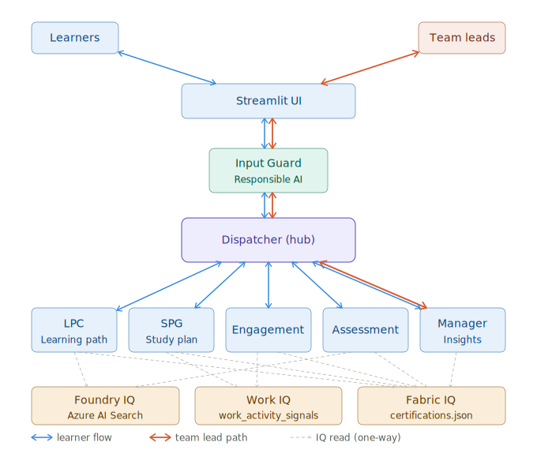

<p align="center">
  
</p>

<p align="center">
  <strong>Agents League Hackathon 2026 · Reasoning Agents Track</strong>
</p>


## What It Does

Most certification tools stop at individual learners, providing a syllabus and a bank of practice questions. Built on **Azure AI Foundry** and powered by **Work IQ**, **Fabric IQ**, and **Foundry IQ**, Certification Preparation Assistant introduces a **dual-track** certification experience: a personalized learning assistant for individual contributors and a certification intelligence platform for team leads.

For **learners**, it adapts study plans to existing knowledge, current certifications, renewal deadlines, real work commitments, and exam timelines.

For **team leads**, it extends beyond exam preparation. Managers can recommend certifications to specific employees, define approved certification pathways for entire teams, and gain real-time visibility into  organizational knowledge coverage and certification progress.

> **Note:** All learner, team, and work-activity data in this repository is entirely synthetic and contains no real personally identifiable information (PII). It is provided for demonstration purposes only.

---


## Agent Architecture

The system follows a **Hub-and-Spoke** pattern with a Responsible AI input guard. All user interactions flow through the Dispatcher, which routes to the appropriate specialist agent.

<p align="center">
  
</p>

### Dispatcher
**File:** `app.py`

Central hub. Receives raw user input, extracts intent, job role, and certification (maps full cert names to codes, e.g. "DevOps Engineer Expert" → AZ-400), and returns a structured routing decision. Passes extracted context downstream to all specialist agents.

### Learning Path Curator (LPC)
**File:** `agents/learning_path_curator.py`

Two-phase session:

- **Phase 1 — Background Familiarity Check:** Presents a self-scoring table (1–5) across all recommended background topics for the target certification.
- **Phase 2 — Learning Path Output:** Uses Azure AI Search (Foundry IQ) to retrieve cited resources. Calculates `study_hours_multiplier` from background scores (Score 5 → 0.33×, Score 1 → 1.25×) and produces `adjusted_study_hours`. Unverifiable sources are flagged as `[unverified]`.

Calls `manager_insights_agent.get_scope()` to determine approved certifications before making recommendations.

### Study Plan Generator (SPG)
**File:** `agents/study_plan_generator.py`

Two-layer design:

- **Python layer:** Reads `work_activity_signals.json` (focus hours × 30% = weekly study budget), applies efficiency multiplier (Pass → 0.85×, Fail → 1.2×, None → 1.0×), orders modules by weak-area priority, detects scheduling risk if projected completion exceeds exam date.
- **LLM layer:** Generates natural language weekly plan with timing recommendations and weak-area analysis.

Supports dynamic adjustment via persistent thread — learner can request changes ("I can't study on Fridays") and the plan recalculates.

### Engagement Agent
**File:** `agents/engagement_agent.py`

- **Python layer:** Classifies workload (High ≥ 20 meeting hrs/week, Medium 12–19, Low < 12). Calculates progress percentage. Classifies urgency (Critical / At Risk / On Track). Checks held certifications for upcoming renewal deadlines.
- **LLM layer:** Personalised check-in message adapted to load level, urgency, and current module.

### Assessment Agent
**File:** `agents/assessment_agent.py`

- Questions grounded in the knowledge base via Azure AI Search — no memory-generated questions.
- Adaptive difficulty: correct → harder, wrong → easier. 5 questions per module.
- Single-step protocol: each answer returns evaluation + next question in one response.
- Pass threshold: 80%. Final score = weighted average across modules using `certifications.json` weights.
- Module scores stored as lists to support multi-attempt history.

### Manager Insights Agent
**File:** `agents/manager_insights_agent.py`

Two functions:

1. **`get_scope(payload)`** — Pure Python. Returns the approved certification list for a given role or team. Lookup order: `team_id` → role → `certifications.json` target_roles. Emits retirement warnings (AZ-204 retiring 2026-07-31, AZ-500 retiring 2026-08-31).
2. **`get_insights(payload)`** — Python calculates team-level stats; LLM generates a manager summary with actionable recommendations. Individual sensitive data is not surfaced.

---

## Manager-Controlled Scope Injection

One of the more interesting design patterns in this system is **manager-controlled scope injection**: the manager user can inject configuration that silently shapes what every learner on their team is allowed to do — without the learner ever seeing it.

**How it works:**

1. The manager logs into the system and opens the **Managing Dashboard** (only visible to users with `is_manager: true`).
2. In the **Scope Management** panel, the manager selects which certifications are approved for their team and saves the change to `manager_team_config.json`.
3. When any learner on that team starts their journey, the **Dispatcher** calls `get_scope()` from the Manager Insights Agent before routing to the Learning Path Curator.
4. `get_scope()` reads the manager-defined approved list and returns it as a constraint.
5. The Learning Path Curator and other downstream agents respect this scope — they will only recommend certifications the manager has approved.

**Why this matters:**

The manager never needs to interact with individual learners directly. By setting scope once, they influence the entire team's certification direction. A manager can restrict a team to role-relevant certifications, prevent spend on deprecated exams, or align the team's upskilling with a business priority — all by adjusting a single list in the dashboard.

This is a clean separation: **managers inject policy**, **agents enforce it**, **learners experience it** as personalised guidance.

---

## Microsoft IQ Layers

| Layer | Role in this system |
|---|---|
| **Foundry IQ** | Azure AI Search index over `data/knowledge/` (11 markdown files). Powers cited question generation (Assessment) and cited resource retrieval (LPC). |
| **Fabric IQ** | Simulated via `certifications.json`. Skill module structure, weightings, study hours, and pass thresholds. |
| **Work IQ** | Simulated via `work_activity_signals.json`. Meeting load, focus hours, and preferred learning slots — used by SPG and Engagement Agent. |

---

## Streamlit UI

**Run:** `streamlit run app.py`

### Layout

**Sidebar (fixed)** + **Chat area (right)**

#### Sidebar Sections

| Section | Description |
|---|---|
| Account block | Username · Role · Team · Log out |
| Register Exam Preparation | Opens inline chat flow — describe intent, set exam date, confirm recommended cert |
| Managing Dashboard | Managers only — team readiness summary |
| Target Certification | Appears after cert is confirmed via registration |
| Background Scores | Collapsible, shown after LPC Phase 1 submission |
| Study Plan | Opens dialog — weekly plan filtered to incomplete modules only |
| Saved Questions | Opens dialog — questions bookmarked during assessment |
| Days until exam | One row per cert (`AZ-400  47 days`), shown only after registration, updates daily |
| Certifications Held | All held certs with retirement dates and renewal deadlines |
| Module Progress | ☑ completed · ☐ in progress with last 3 assessment scores |
| Calendar | Auto-marks rest days from Work IQ preferred slots; user can toggle any day |

#### Chat Message Types

| Type | Description |
|---|---|
| `text` | Standard assistant / user message |
| `exam_register` | Inline form — exam date picker + cert intent input |
| `cert_confirm` | Confirm recommended certification; sets Target Certification in sidebar on Yes |
| `survey_confirm` | Offer background knowledge survey; Skip goes directly to SPG with default hours |
| `slider_form` | Background scoring 1–5 per topic, single submission |
| `hours_input` | Hours studied today |
| `completion_check` | Yes / Not yet — module completion |
| `continue_check` | Continue / Stop for today |

#### Assessment Dialog

- Adaptive A/B/C/D questions with difficulty level displayed
- Each answer shows ✅/❌ evaluation + explanation + knowledge point
- **🔖 Save** bookmarks the question to `saved_questions.json`
- **Next Question →** / **Finish →** advances the session

---

## Learner Session Flow

### New User
1. Log in → click **📝 Register Exam Preparation**
2. Describe goal in natural language → Dispatcher extracts certification code
3. **Cert recommendation** — system explains why this cert fits the role, shows level / study hours / validity
4. **Background survey offer** — Yes → LPC scoring (1–5 per topic) → personalised study hours · Skip → default hours
5. **Study Plan** generated and saved; view in sidebar
6. Enter per-module session loop

### Returning User
Loads saved state, restores plan thread, enters session loop directly — no LPC or SPG re-run.

### Per-Module Session Loop

```
1. Check exit conditions (all passed / exam tomorrow / cert retired)
2. Show current module + days until exam
3. Log hours studied today → Engagement Agent check-in
4. "Have you completed [module]?"
   ├─ Not yet → offer plan adjustment
   └─ Yes → Assessment (5 adaptive questions in dialog)
             ├─ Pass ≥ 80% → advance module, save score to history
             └─ Fail < 80% → auto-adjust plan (focus on weakest module)
5. "Continue today?" → Yes: next module / No: Manager Insights → end session
```

---

## Test Users (TEAM-PE — Platform Engineering Team)

| ID | Name | Role | Demo Scenario |
|---|---|---|---|
| `L-TEST-001` | Alice | Cloud Engineer | Returning user — AZ-204 in progress, study plan saved, 1 module passed |
| `L-TEST-002` | Bob | DevOps Engineer | New user — no exam registered, full flow demo |
| `L-TEST-003` | Charlie | Senior Solutions Architect | 7 certs held, no new exam planned, cert renewals tracked |
| `MGR-PE` | Dory | Manager | Manager view — team dashboard via Managing Dashboard button |

---

## Project Structure

```
tat-reasoning-agent/
├── app.py                          # Streamlit UI — main entry point
├── main.py                         # CLI entry point
├── dev_reset.py                    # Resets L-TEST-* records to baseline
├── requirements.txt
├── .streamlit/
│   └── config.toml                 # Theme: primaryColor = rgb(30, 58, 95)
├── agents/
│   ├── dispatcher.py
│   ├── learning_path_curator.py
│   ├── study_plan_generator.py
│   ├── engagement_agent.py
│   ├── assessment_agent.py
│   └── manager_insights_agent.py
└── data/
    ├── certifications.json         # 11 certifications — modules, weights, retirement status
    ├── learner_performance.json    # Learner records, scores, study plans, module progress
    ├── work_activity_signals.json  # Meeting load, focus hours, preferred learning slots
    ├── manager_team_config.json    # 6 teams — approved certification scope
    ├── manager_role_config.json    # Role-based certification fallback lists
    ├── saved_questions.json        # Bookmarked assessment questions (runtime)
    └── knowledge/                  # Foundry IQ knowledge base (Azure AI Search)
        ├── az-104.md · az-204.md · az-305.md · az-400.md · az-500.md · az-900.md
        ├── azure-solutions-architect-expert.md · devops-engineer-expert.md
        └── dp-300.md · dp-700.md · sc-900.md
```

---

## Setup

### Prerequisites

- Python 3.11+
- Azure subscription with an Azure AI Foundry project
- Azure AI Search index `cert-knowledge-base-index` populated with `data/knowledge/`
- IAM roles on the Search resource: `Search Index Data Reader` · `Search Service Contributor`

### Install

```bash
python -m venv .venv
source .venv/bin/activate
pip install -r requirements.txt
```

### Environment Variables

Create a `.env` file in the project root:

```
AZURE_AI_PROJECT_ENDPOINT=https://<your-project>.services.ai.azure.com/api/projects/<project-id>
AZURE_AI_MODEL_DEPLOYMENT=gpt-4o
FOUNDRY_KNOWLEDGE_BASE_CONNECTION_ID=<azure-ai-search-connection-id>
```

Authentication uses `DefaultAzureCredential`. Run `az login` before starting.

### Run

```bash
streamlit run app.py
```

---

## Responsible AI

- **Input guard** — enforced before the Dispatcher; off-topic requests are not routed to specialist agents.
- **Source grounding** — Assessment Agent and LPC must use Azure AI Search; memory-generated content is blocked. Unverifiable sources are flagged `[unverified]`.
- **No PII** — all identifiers are synthetic. Manager Insights aggregates team data without surfacing individual sensitive details.
- **Retirement warnings** — proactive warnings at registration and in the sidebar whenever a target certification has a known retirement date.

---

## Dev Utilities

```bash
python dev_reset.py    # Reset L-TEST-* records to baseline
streamlit run app.py   # Launch UI
```

---

Built for the Agents League Hackathon 2026 — Reasoning Agents Track.
